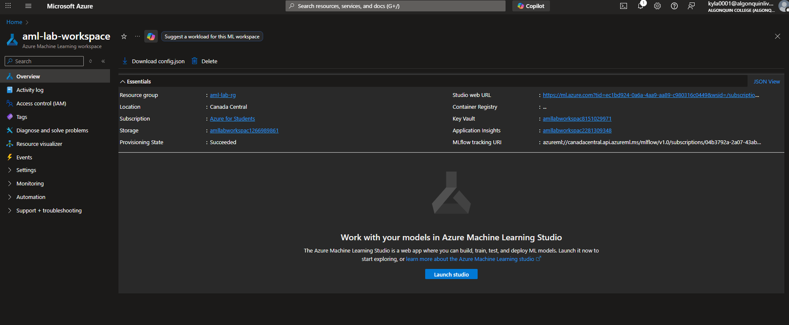
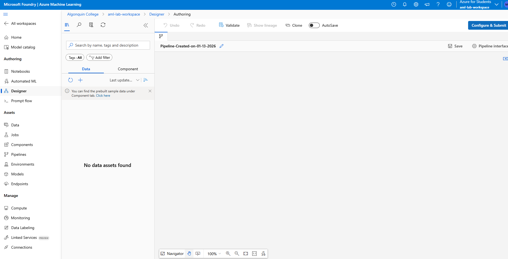
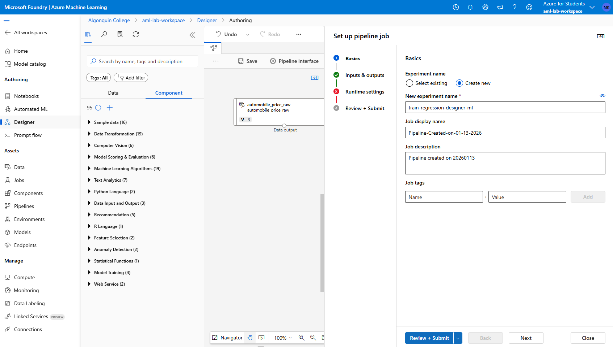
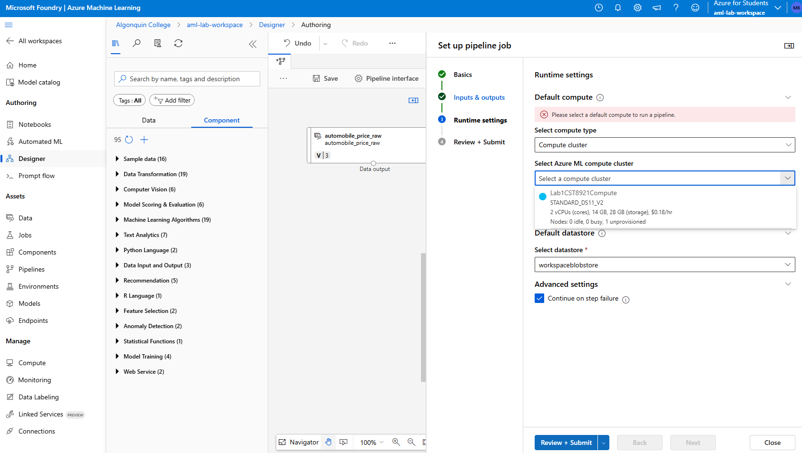
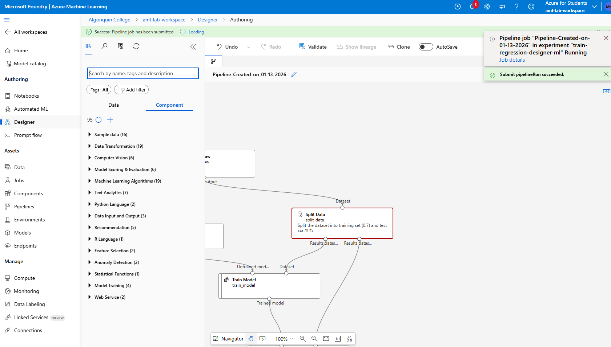
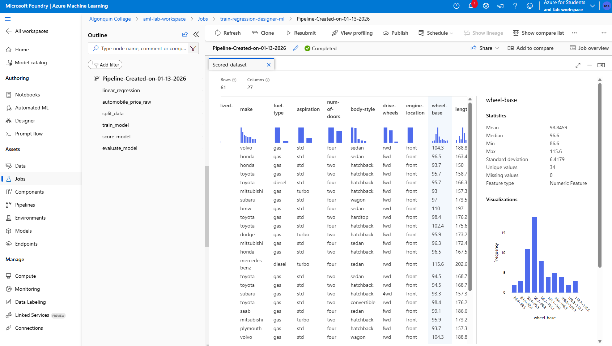

# Lab 1

## Name: Kylath Mamman George

## Student Number: 041198835

## Step 1

Creating ML workspace:

## Step 2

All options have been looked at on the left side panel.

## Step 3

## Step 4

Adding the sample data:

## Step 5-6

## Step 7-9

## Step 10-12

## Step 13

