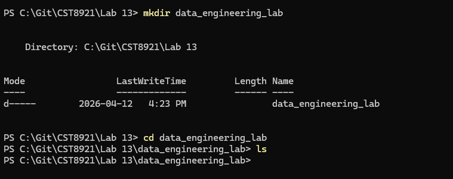
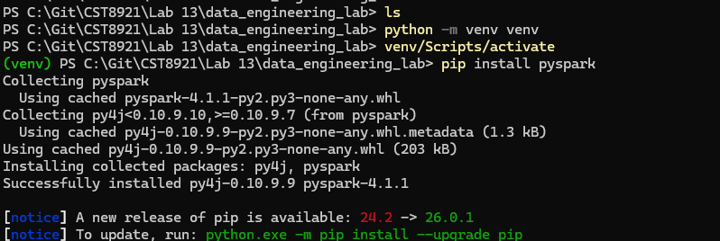
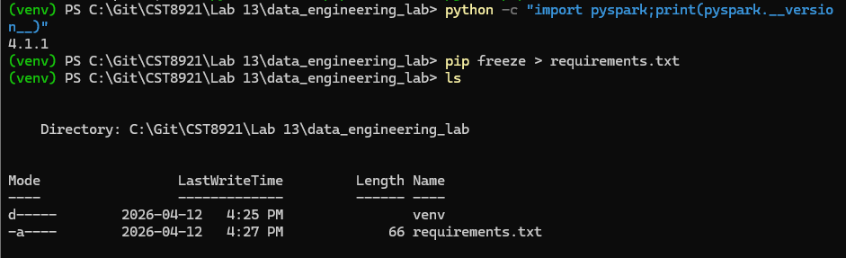
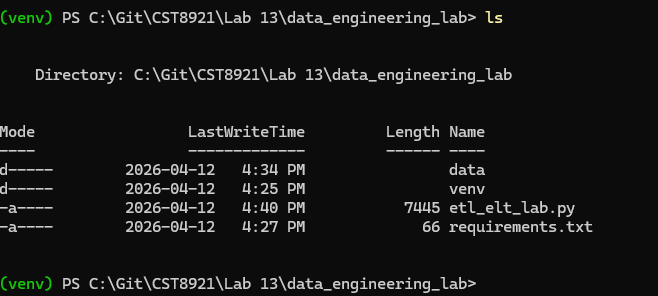
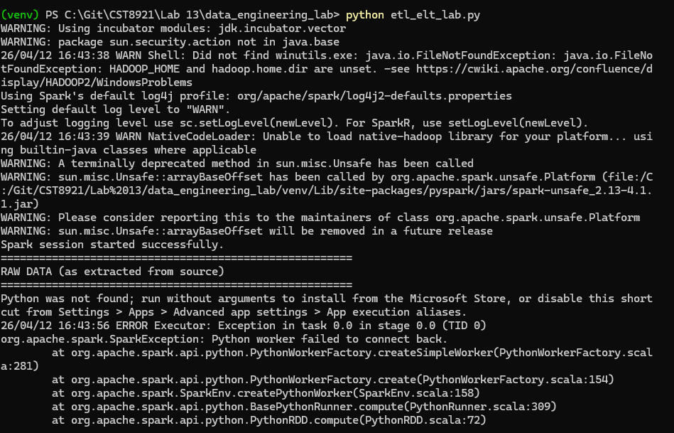

# Lab 11

## Name: Kylath Mamman George

## Student Number: 041198835

## Part 1

### Step 1.1

### Step 1.2

### Step 1.3

### Step 1.4

### Step 1.6

## Part 2

### Step 2.1

### Step 2.2

### Step 2.3

## Part 3

### Part 3.1

### Part 3.2

Error even with the suggested fix:

## Part 4

1. Both pipelines produced the same final output. What is the key architectural difference between them?

The difference is where the transformation happens and in what state the data is stored first. For ETL, the data is cleaned and filtered in-memory before being written to the disk. The final storage only contains the clean version.

2. The ELT pipeline preserved the raw data in orders_raw. Why is this valuable when business requirements change?

Preserving the orders_raw is important because it provides Data Provenance and Reversibility. If we want to see cancelled orders in the reports, the ETL approach would require you to re-run the entire pipeline from the source.

3. The ELT pipeline built a category_summary mart as a second SQL step without touching the ETL path. How does this demonstrate ELT's flexibility?

It shows ELT's decoupled nature. In ELT, once the raw data is in the "lake", you can build infinite different "marts" for different teams without interference.

4. If this dataset were 100 GB on a distributed Spark cluster, which approach would likely perform better and why?

ELT usually performs better because loading data is usually a high speed operation. Once the data is in a file system, Spark can use all of its nodes to transform the data in parallel. ETL has the advantage of being able to experiment with transformations locally on the cluster without the overhead of moving the massive data over the network again.

5. Identify one real-world scenario where you would still prefer ETL over ELT.

ETL would be preferred in areas revolving around Data Privacy and Compliance, where PII like Social Security numbers should never be loaded into a general purpose data lake. We can use The ETL pipeline to mask, anonymize, or drop the sensitive columns before the data gets to permanent storage.