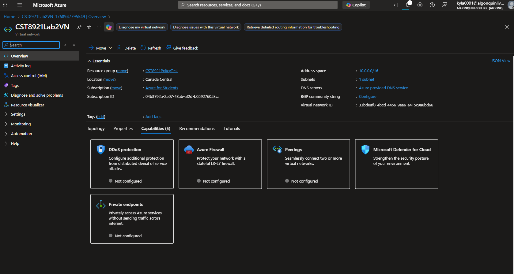
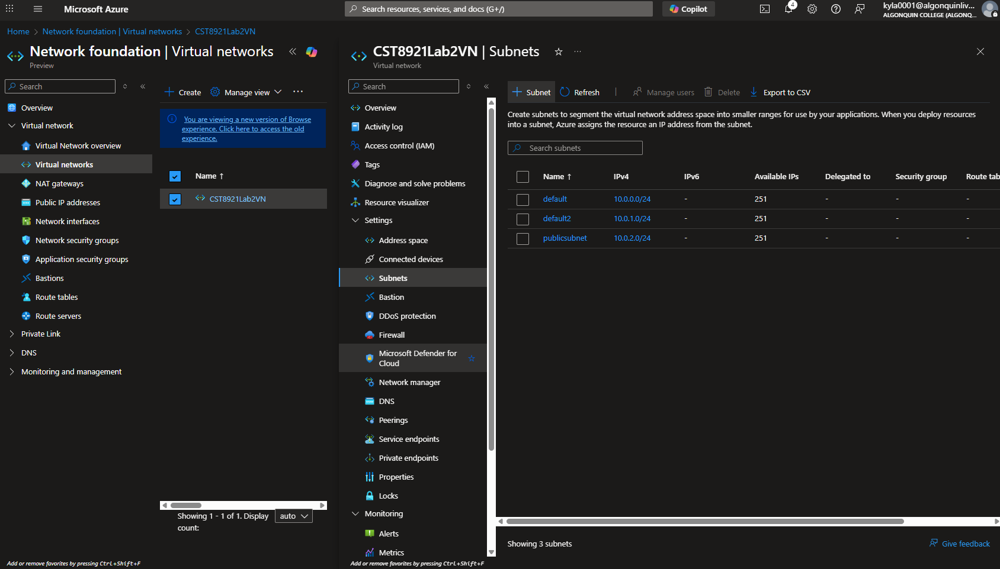
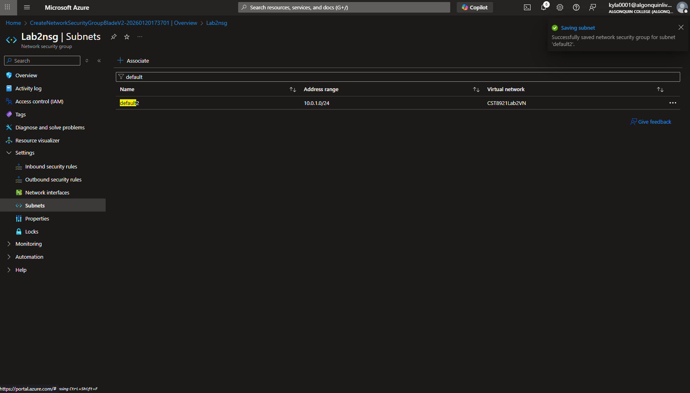
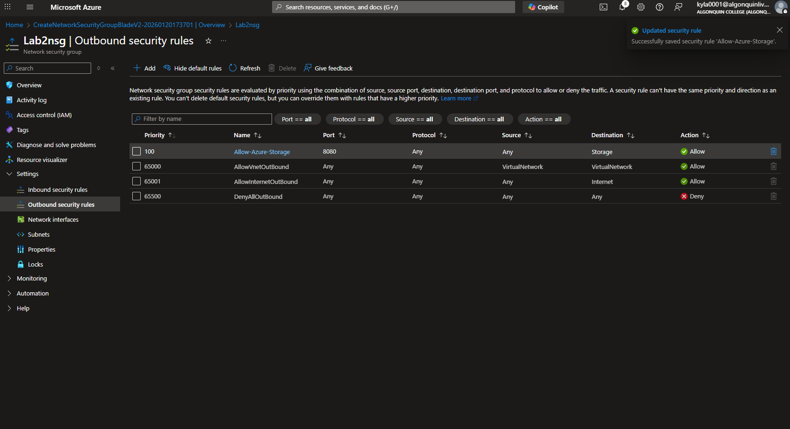
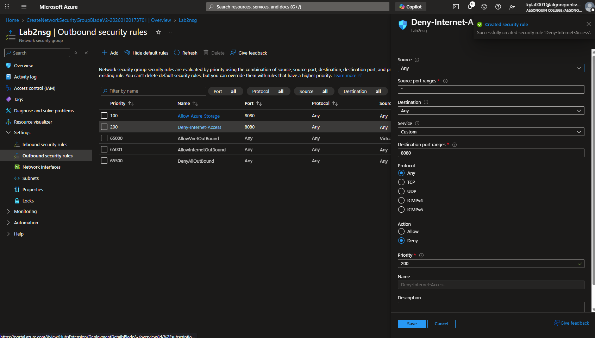

# Lab 2

## Name: Kylath Mamman George

## Student Number: 041198835

## Task 1

### Steps 1-4

Policy Definitions for "Allowed locations":

### Steps 5-7

Subscription selection:

Canada Central Selection:

Policy Created:

### Validation

Canada Central Selection:

US East 2 Selection:

## Task 2

### Steps 1-5

Creating the Virtual Network:

## Task 3

Creating private and public subnets: Default2 is the private subnet

## Task 4

Associated NSG with the private subnet(default2):

## Task 5

Created Outbound rule for allowing azure storage:

Create Outbound rule for denying internet access:

