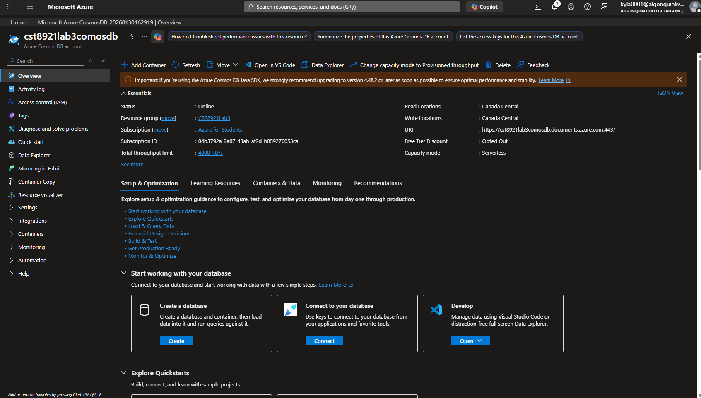
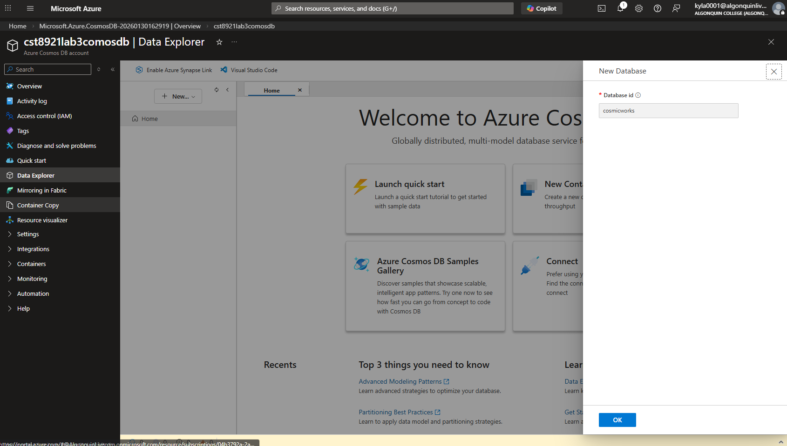
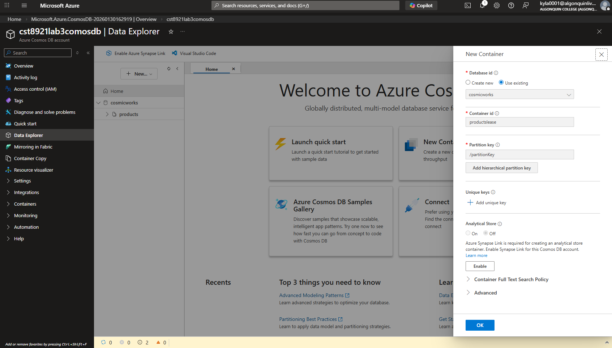
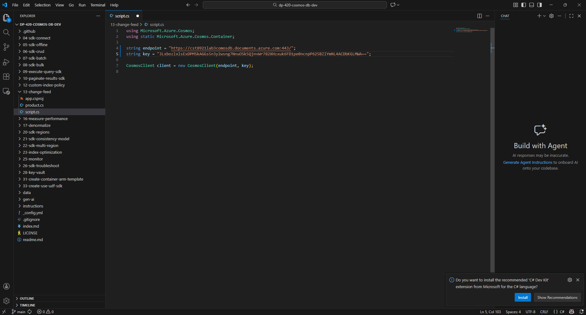
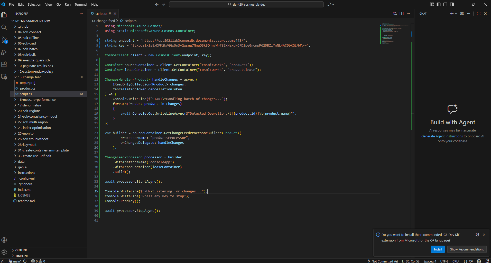
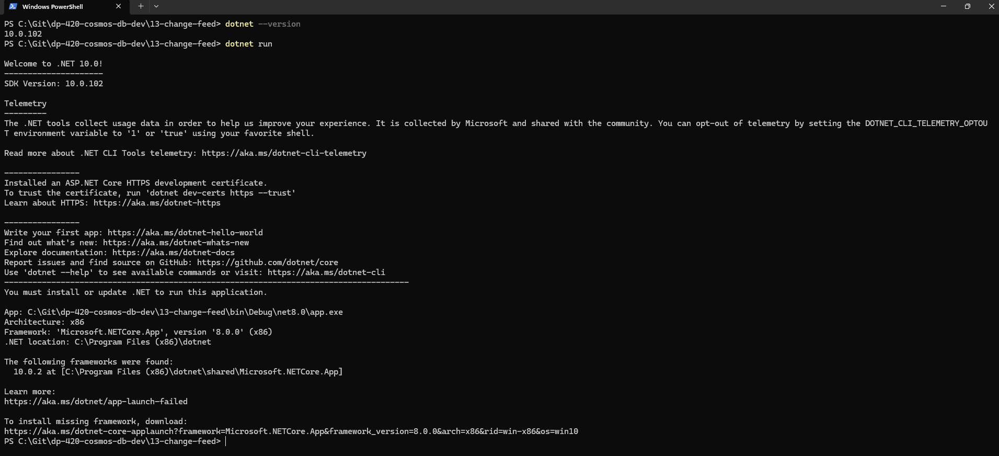
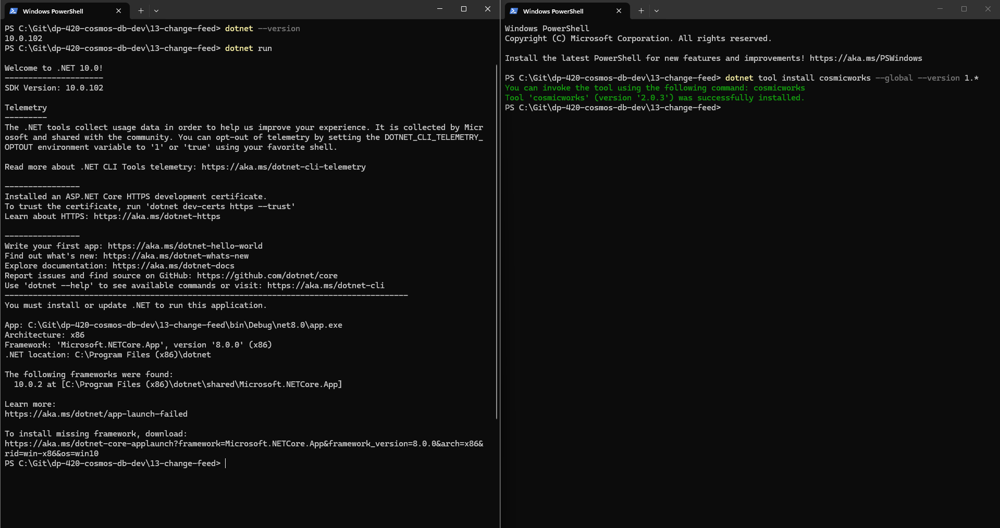
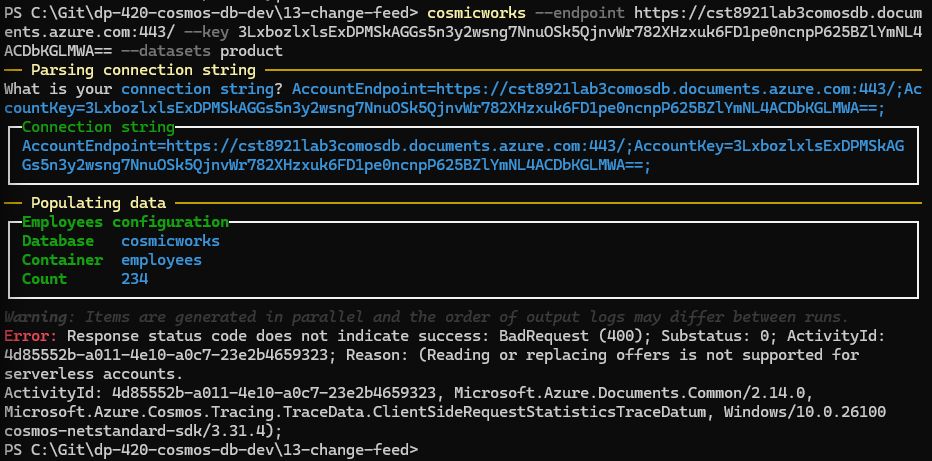
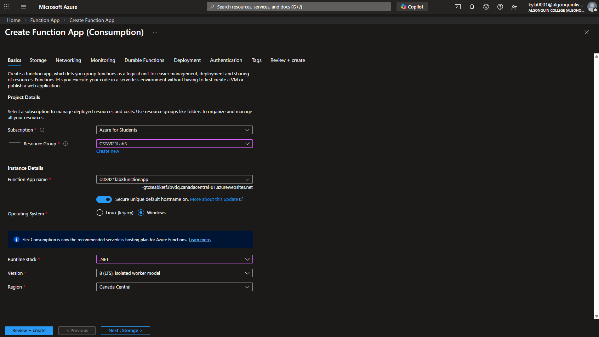
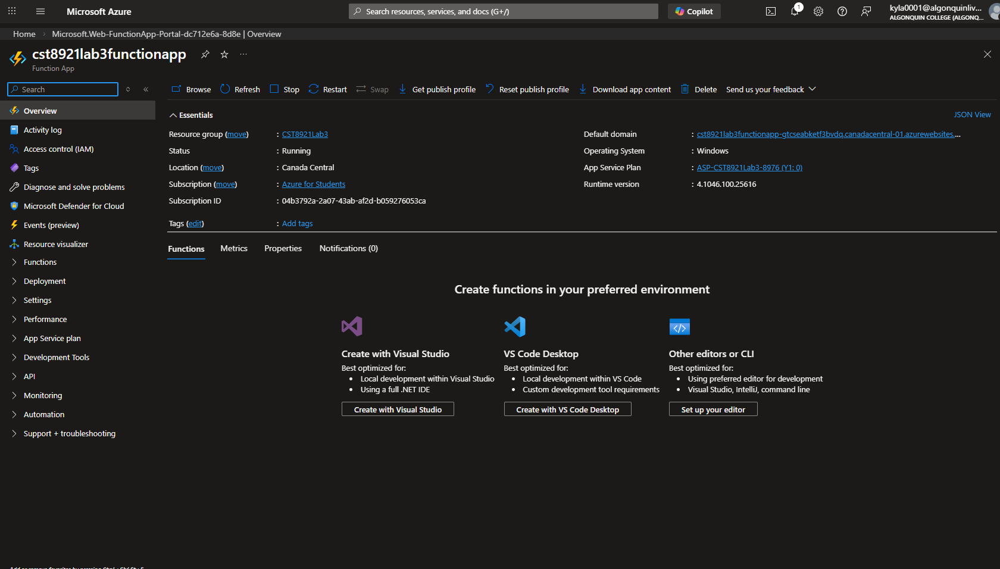

# Lab 3

## Name: Kylath Mamman George

## Student Number: 041198835

## Task 1: Process change feed events using the Azure Cosmos DB for NoSQL SDK

### Steps 1-5

### Step 6-7

### Step 8

### Step 9

### Step 10-16

### Step 17-20

### Step 21-25

I could not run dotnet in visual studio so I had to use a separate terminal for it.

### Step 26-27

### Step 28-33

## Task 2: Create an Azure Function app and Azure Cosmos DB-triggered function

### Step 1-3

There is no version 6:

### Step 4-6

I could not get the rest to work because the function pane does not have a create option for the cosmos db trigger.
