# Lab 5

## Name: Kylath Mamman George

## Student Number: 041198835

## Step A1: Create Storage Account

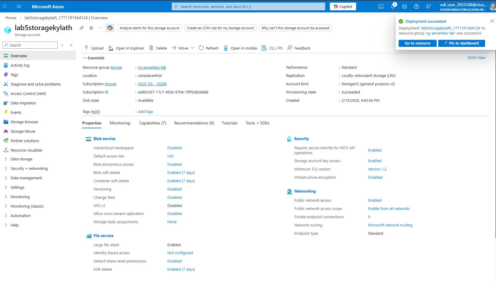

## Step A2: Create Blob container

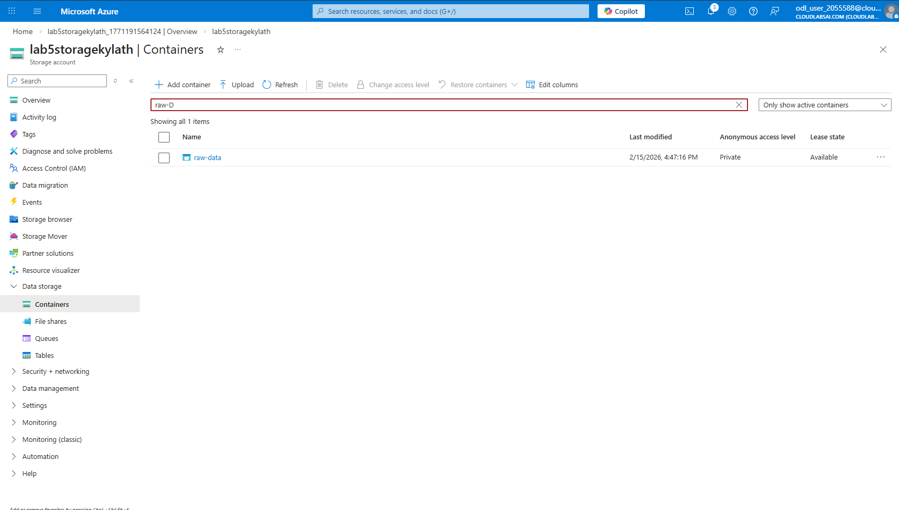

## Step B1: Create function app

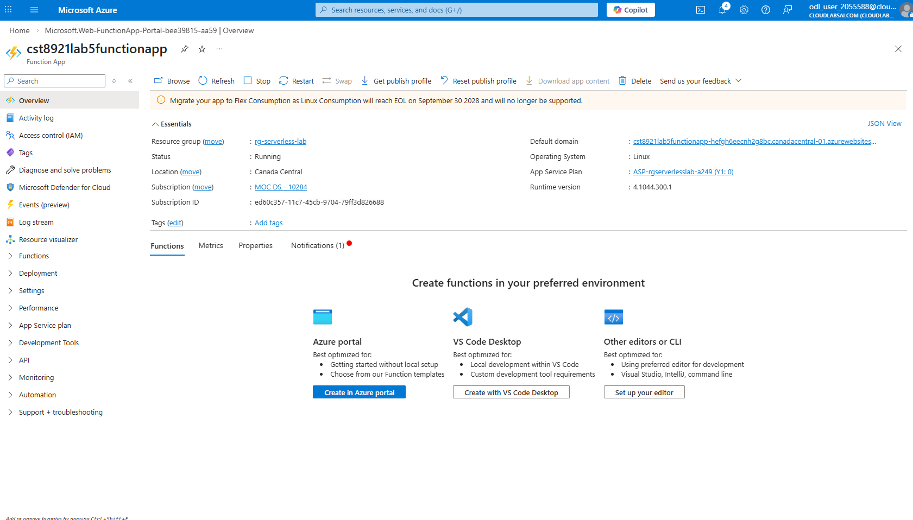

## Step B2: Create Function

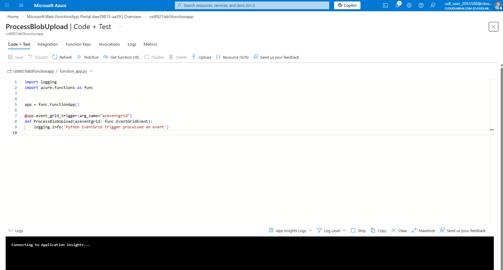

## Step C1: Create Event Subscription

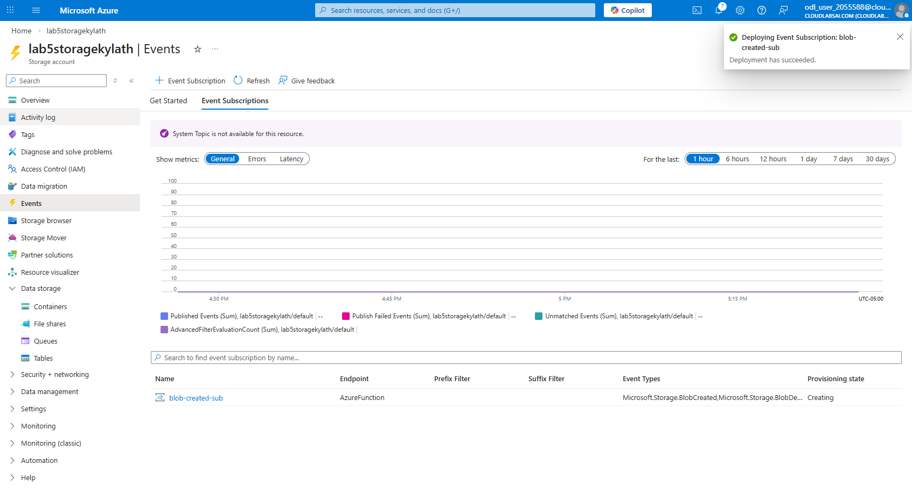

## Step D1: Update Function Code

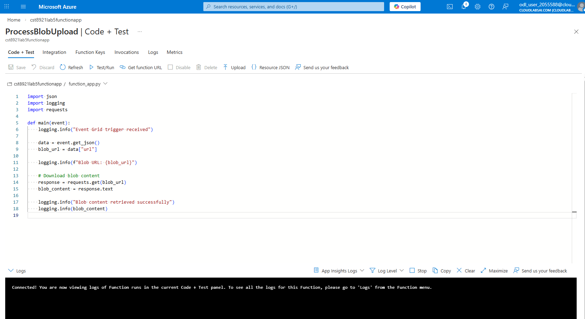

## Step D2: Verify Function Settings

I am not sure where this is in the screenshot, but I did enable applicaton insights on creation

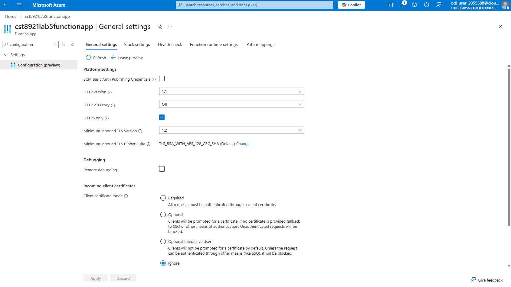

## Step E1: Create Sample Data File

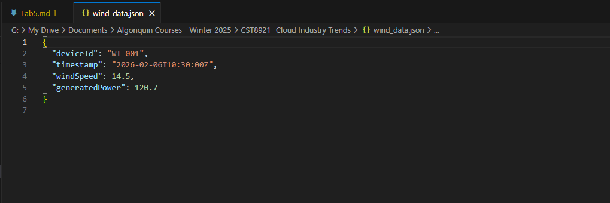

## Step E2: Upload sample data file

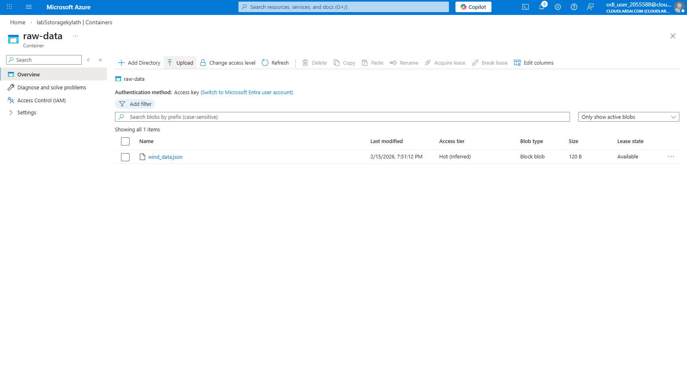

## Step F1: Confirm function invocation

Uploading data seems to make my function disappear completely which means I cannot finish the lab........

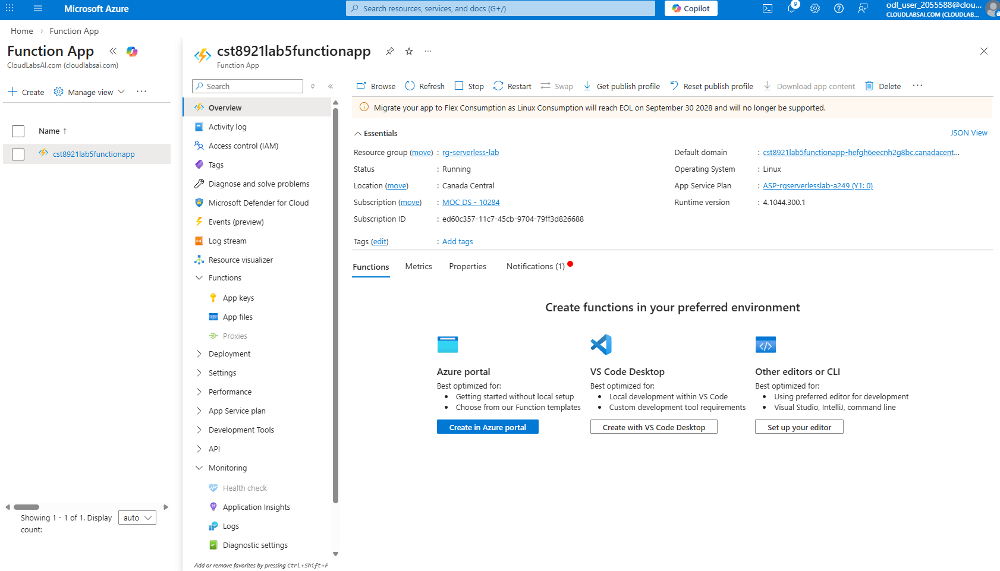

## Part G: Cleanup

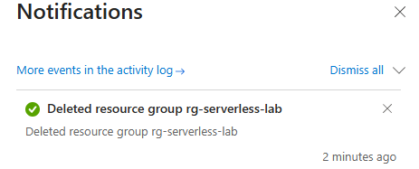